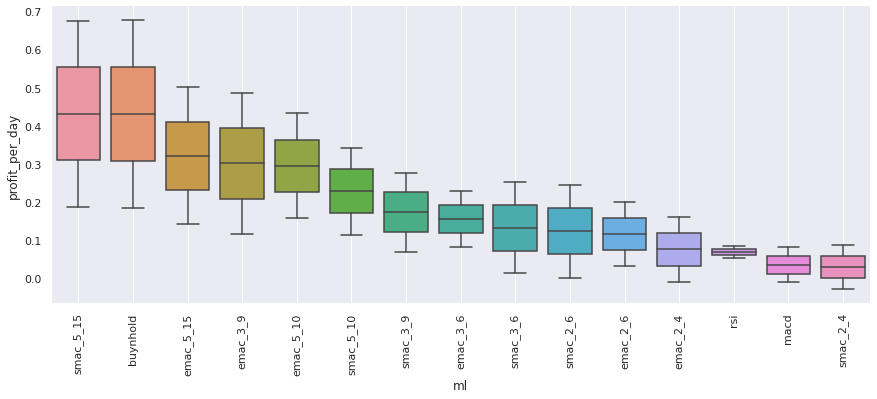
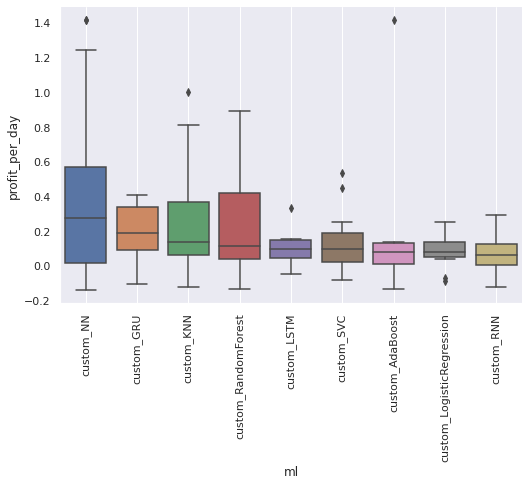
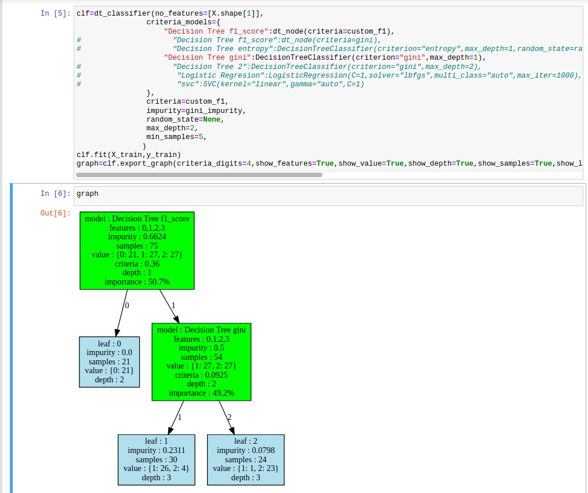
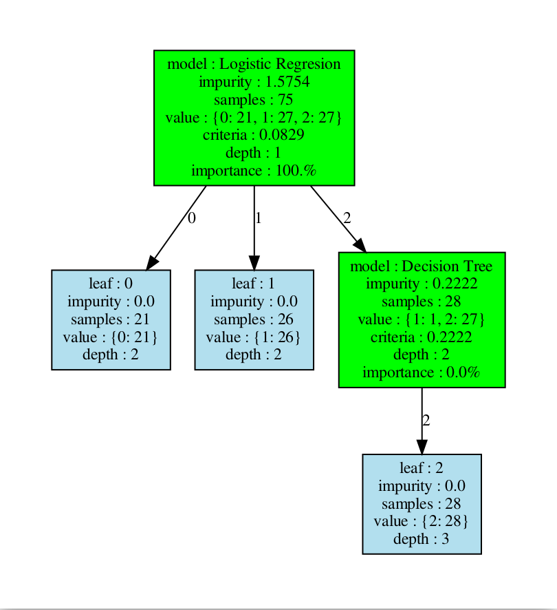
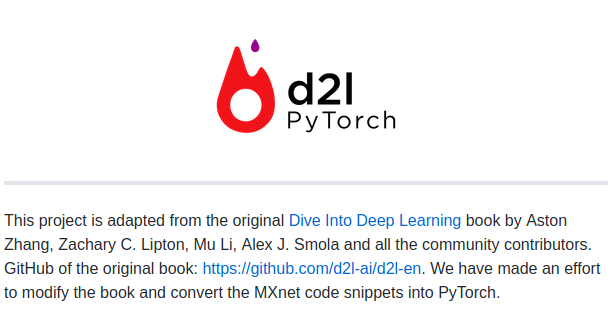
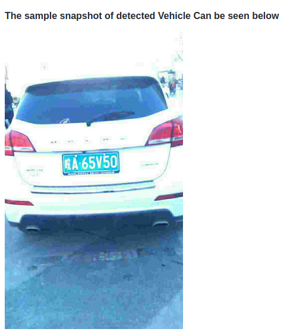
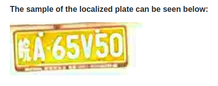
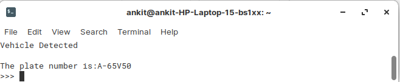

# PROJECTS

## Project 1: EdgeAICam - Minimal Person Detection for Edge AI Applications
To view the complete documentation: [Project README](./README_for_EdgeAiCam.md)

<!-- ```markdown -->
- Goal: Lightweight, real-time person detection system optimized for edge AI and computer vision business applications.
- Key Features: Fast and efficient YOLOv8n model (12MB), real-time detection (4-10 FPS), advanced visualization with bounding boxes and trajectory tracking, 30-frame trajectory buffer with continuity constraints.
- Business Applications: Retail analytics, smart surveillance, occupancy monitoring, industrial safety, and IoT-enabled computer vision solutions for edge devices.
- Performance: Cross-platform GPU acceleration (DirectML/CUDA), <500MB RAM usage, 10-30ms inference time per frame.
- Tools: YOLOv8n, OpenCV, ONNX runtime, Python with minimal dependencies.
<!-- ``` -->

- EdgeAICam detection interface with real-time tracking
  

- Complete video demonstration showing system in action
  <video src="demo/video_demo.mp4" controls width="100%" height="auto">
    Your browser does not support the video tag. <a href="demo/video_demo.mp4">Download video</a>
  </video>

## Project 2: YouTube Channel Acquisition System
To view the complete documentation: [Project README](./README_for_youtube_scrapper.md)

<!-- ```markdown -->
- Goal: Automated discovery and acquisition of inactive Indian YouTube channels as digital assets.
- Phase 1: AI-powered keyword generation with dual-mode scraping (channel-first + video-first discovery).
- Advanced filtering for inactivity (90-730 days), quality assessment, and contact information extraction.
- Target: 50K-1M subscriber channels with transferable, evergreen content and valid contact information.
- Tools: FastAPI (backend), n8n (automation workflow), YouTube Data API (25+ keys), Pandas (data processing).
<!-- ``` -->
- Complete workflow visualization from keyword generation to channel discovery<br>
  

- AI-powered keyword generation targeting inactive channels<br>
  

- Smart keyword creation with behavioral pattern analysis<br>
  

- Comprehensive channel data with contact information and acquisition potential<br>
  

## Project 3: Software Analysis and Design for Trading Cryptocurrency (Final Year Project, IIT Roorkee)
To Download the complete PDF: [Project Report](./B_Tech_Project_Final_Report.pdf)

<!-- ```markdown -->
- Goal: Identify profitable cryptocurrency trading strategies.  
- Methods: Traditional (e.g., SMAC, EMAC, RSI, MACD, Buy-and-Hold) and machine learning models (Logistic Regression, Random Forest, SVC, KNN, Neural Networks).  
- Evaluation: Profit-per-day metric with visual comparisons.  
- Conclusion: SMAC(5,15) and Buy-and-Hold yield the highest median of 4.2 profit-per-day.  
- Tools: BeautifulSoup (scraping), Fastquant (backtesting), Sklearn & PyTorch (ML), Matplotlib (visualization).  
<!-- ``` -->
- Profit per Day comparison for traditional strategies<br>


- Profit per Day comparison for machine learning strategies


## Project 4: [Decision Tree Steroid](https://github.com/ankitaharwal/Decision_Tree-Steroid) (Data Science Group, IIT Roorkee)
To verify this certificate visit: [Link](https://ecertificate.iitr.ac.in/verification/6694e25f-3ec0-48b7-a168-c469dfd30ed7)

<!-- ```markdown -->
- Variant of Advanced Decision Tree from scratch.
- Each node could be any Machine Learning model like 
Neural Network, SVM, or basic decision
tree node.
- It can have a non-linear decision boundary, unlike a standard 
decision tree, which only has a parallel feature boundary.
- Made a customizable graph that can show different features 
of each node such as impurity, class distribution, etc.
- Whole Tree structure can viewed in graphical format.
- Tools: Python (SK learn) and graphviz.
<!-- ``` -->
- Working decision tree with only standard node:<br>
  

- Classification with logistic regression and standard node:
  

## Project 5: [D2l-PyTorch](https://github.com/dsgiitr/d2l-pytorch), Data Science Group, IIT Roorkee
To verify this certificate visit: [Link](https://ecertificate.iitr.ac.in/verification/419fffae-e64d-46bc-930e-8b2e8f0e1df2)

<!-- ```markdown -->
- Ported MXNet Code into Pytorch for the book Dive Into Deep Learning by Aston
Jhang et al.
- Converted the book to an interactive Jupyter Notebook format.
- Contributed and maintained d2l-pytorch on GitHub (3000+ stars and 900+
forks).
- Tools: Python(Pytorch).
<!-- ``` -->
- Logo and description of the repo:
  


## Project 6: [Number plate Detection](https://github.com/dsgiitr/np_detection), Data Science Group, IIT Roorkee
To verify this certificate visit: [Link](https://ecertificate.iitr.ac.in/verification/2c5c8c95-0dd6-4ab2-bed7-8e74ded1812d)

<!-- ```markdown -->
- Detect vehicles and record their number plates from CCTV cameras for security
purposes.
- The system tracks the vehicle and then separates the number plate from the vehicle
(openCV) and outputs the digits (OCR).
- Tools: Pytorch, openCV and YOLO.
<!-- ``` -->
- Working Sample:
  

  

  
