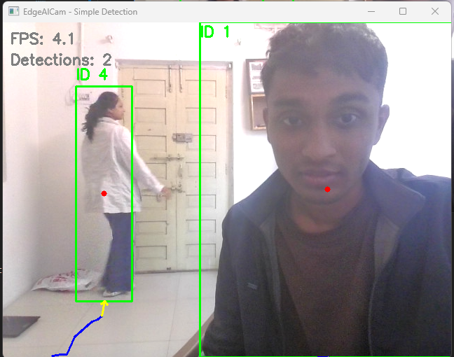

# EdgeAICam - Minimal Person Detection

Simple, focused person detection system using YOLOv8n with real-time visualization and trajectory tracking.

## Quick Start

```bash
# Install dependencies
pip install -r requirements.txt

# Run detection
python src/main_simple.py
```

## Demo

### Screenshot Preview


*Real-time person detection showing:*
- Green bounding boxes with tracking IDs
- Center point markers (red dots)
- Trajectory paths (blue lines)
- FPS and detection count overlays

### Video Demonstration
A complete video demo showing the system in action is available for download:

📥 [Download Video Demo](demo/video_demo.mp4) (983KB, MP4 format)

*Contents:*
- Real-time camera detection
- Person tracking across multiple frames
- Performance monitoring
- Visualization features

## Features

- **Single YOLOv8n model** - Fast and lightweight
- **Real-time detection** - Person detection from camera
- **Advanced visualization** - Bounding boxes, trajectories, and tracking
- **Trajectory modeling** - Movement path tracking with continuity constraints
- **Minimal dependencies** - Easy to install and run
- **GPU acceleration** - DirectML (AMD) and CUDA (NVIDIA) support

## Configuration

Edit `config/system_config.yaml` to customize camera settings, detection parameters, and performance thresholds. See the demo video for examples of different configuration options in action.

```yaml
camera:
  source: 0
  resolution: [640, 480]
  fps: 20

detection:
  model_path: "models/yolov8n.onnx"
  confidence_threshold: 0.5
  input_size: [640, 640]
  device: "dml"  # cpu/dml/cuda

performance:
  low_fps_threshold: 8
  high_fps_threshold: 15
  low_confidence_threshold: 0.7
  high_confidence_threshold: 0.5
  normal_confidence_threshold: 0.6
```

## Project Structure

```
EdgeAICam/
├── demo/                    # Demo assets
│   ├── screenshot_demo.png  # Application screenshot
│   └── video_demo.mp4       # Video demonstration
├── src/
│   ├── core/simple_detector.py  # Minimal YOLOv8n detector
│   ├── core/trajectory_manager.py # Trajectory tracking
│   ├── utils/video_capture.py   # Video input handling
│   └── main_simple.py          # Main application
├── config/system_config.yaml    # Configuration
├── models/yolov8n.onnx          # YOLOv8 model
├── requirements.txt            # Dependencies
└── README.md                  # This documentation
```

## Usage Examples

Run the application and expect to see output similar to the screenshot above:

```bash
python src/main_simple.py
```

The interface provides:
- **Visual feedback**: Bounding boxes, trajectories, and tracking IDs
- **Performance metrics**: Real-time FPS display and monitoring
- **Tracking information**: Person counts and movement paths
- **Interactive controls**: Press 'q' to quit the application

## Performance

- **Inference Time**: 10-30ms per frame
- **FPS**: 10-20 FPS on AMD hardware (640×480 resolution)
- **Memory**: <500MB RAM
- **Model Size**: 12MB (YOLOv8n)
- **Trajectory Buffer**: 30 frames per track with continuity constraints

## License

MIT License